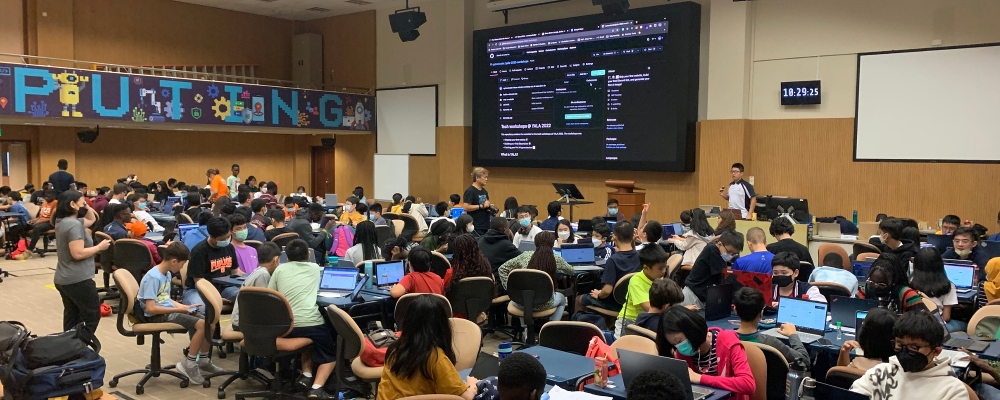

## Hey, welcome to the International Junior Honour Society 👋

The International Junior Honour Society (IJHS) is a global community of young people who are passionate about making a difference in their communities. We are a non-profit organisation that aims to empower young people to become leaders in their communities and beyond. We do this by providing them with the tools and resources they need to make a difference in their communities, all while having fun and making new friends.

## 🤗 An international community

The Student Leadership Council (SLC) is the governing body of the IJHS. It is made up of young people from all over the world who are passionate about making a difference in their communities. The SLC is responsible for the overall direction of the IJHS and is responsible for making decisions that affect the organisation.

It is split into 3 committees:

- The **Community Service Projects (CSP)** Committee is responsible for managing the IJHS' community service projects and ensuring that they are carried out successfully.
- The **Development and Improvement Programs (DIP)** Committee manages community initiatives and programs that aim to improve the IJHS and its members as individuals.
- The **Technology and Communications (T&C)** Committee is responsible for managing the IJHS' online presence and ensuring that the IJHS' members are kept up to date with the latest news and events.

## 🤝 Contributing to the IJHS

To join the SLC, you must be a member of the IJHS. You can fill out the application form [here](https://forms.gle/KPMLG9L8paXJq7Jj8).

Additionally, you can also contribute to the IJHS by participating in one of our future open source projects. We will be releasing more information about these projects in the future.
